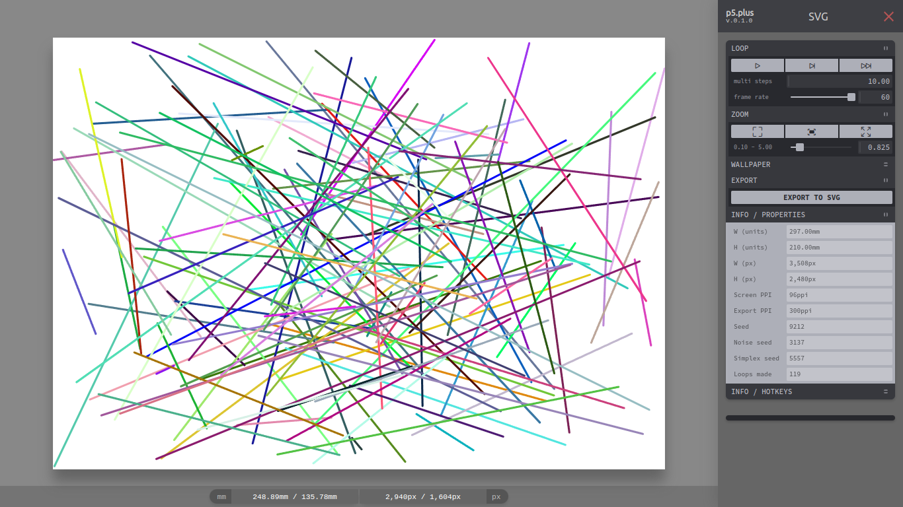

## p5.plus ( !!! alpha stage / things will change !!! )
### (replacement for p5.start2d.js)

 

 

p5.plus is an p5.js extension to ease the creation of 2D Static art adding:

    - gui
    - panning zooming
    - use of mm, cm, inches
    - support for svg (with the p5.js-svg extension)
    - export with one click to png (p2d mode) or svg (svg mode)
    - shortkeys

### CREDITS

[p5.js](https://p5js.org/) : &nbsp;No p5 extension without p5 library

[tinykeys](https://jamiebuilds.github.io/tinykeys/) : &nbsp;Tiny but very nice library for keybindings

[tweakpane](https://cocopon.github.io/tweakpane/) : &nbsp;Compact pane library for fine-tuning parameters and monitoring value changes.

[simplex noise](https://github.com/josephg/noisejs) : &nbsp;Simple library for 2d & 3d perlin noise and simplex noise

 

### CHANGES TO THE NORMAL WAY OF USING p5.js

- In `createCanvas()`,  Instead of providing `width` and `height` you have to provide an object
- `noLoop()` is the default, since the main purpose of this addon is to create static art.

 

### EXAMPLES

see the __artworks folder, or open with p5 web editor :

[p5.plus template](https://editor.p5js.org/ElTapir/sketches/GPNQjGTrg "p5.plus template")

 

### LICENSE

Apache 2.0,  see [LICENSE](LICENSE.txt) for details.
